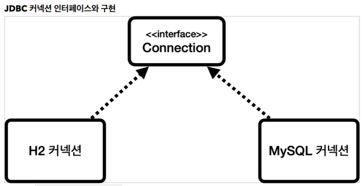
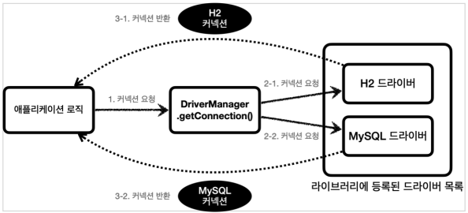

## 데이터베이스 연결

### JDBC DriverManager 연결 이해



- JDBC 는 java.sql.Connection 표준 커넥션 인터페이스를 정의한다.
- H2 데이터베이스 드라이버는 JDBC Connection 인터페이스를 구현한 `org.h2.jdbc.JdbcConnection` 구현체를 제공한다.

### DriverManager 커넥션 요청 흐름



JDBC 가 제공하는 DriverManager 는 라이브러리에 등록된 DB 드라이버들을 관리하고, 커넥션을 획득하는 기능을 제공한다.

1. 애플리케이션 로직에서 커넥션이 필요하면 `DriverManager.getConnection()` 을 호출한다.
2. `DriverManager` 는 라이브러리에 등록된 드라이버 목록을 자동으로 인식한다. 이 드라이버들에게
   순서대로 다음 정보를 넘겨서 커넥션을 획득할 수 있는지 확인한다.
   URL: 예) jdbc:h2:tcp://localhost/~/test
   이름, 비밀번호 등 접속에 필요한 추가 정보
   여기서 각각의 드라이버는 URL 정보를 체크해서 본인이 처리할 수 있는 요청인지 확인한다. 예를
   들어서 URL이 jdbc:h2 로 시작하면 이것은 h2 데이터베이스에 접근하기 위한 규칙이다. 따라서 H2
   드라이버는 본인이 처리할 수 있으므로 실제 데이터베이스에 연결해서 커넥션을 획득하고 이 커넥션을
   클라이언트에 반환한다. 반면에 URL이 jdbc:h2 로 시작했는데 MySQL 드라이버가 먼저 실행되면
   이 경우 본인이 처리할 수 없다는 결과를 반환하게 되고, 다음 드라이버에게 순서가 넘어간다.
3. 이렇게 찾은 커넥션 구현체가 클라이언트에 반환된다.
   우리는 H2 데이터베이스 드라이버만 라이브러리에 등록했기 때문에 H2 드라이버가 제공하는 H2
   커넥션을 제공받는다. 물론 이 H2 커넥션은 JDBC가 제공하는 `java.sql.Connection` 인터페이스를
   구현하고 있다.

### H2 데이터베이스 드라이버 라이브러리

```groovy
runtimeOnly 'com.h2database:h2' //h2-x.x.xxx.jar
```