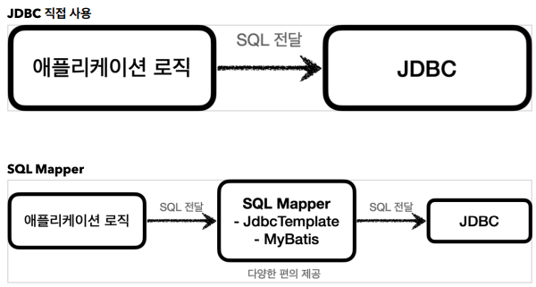
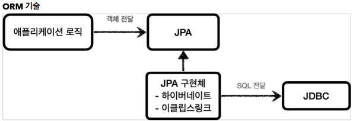

## JDBC 와 최신 데이터 접근 기술

JDBC 는 1997년에 출시될 정도로 오래된 기술이고, 사용하는 방법도 복잡하다. 그래서 최근에는 JDBC를
직접 사용하기 보다는 JDBC 를 편리하게 사용하는 다양한 기술이 존재한다. 대표적으로 SQL Mapper와
ORM 기술로 나눌 수 있다.

- SQL Mapper
  - 장점: JDBC 를 편리하게 사용하도록 도와준다.
    - SQL 응답 결과를 객체로 편리하게 변환해준다.
    - JDBC 의 반복 코드를 제거해준다.
  - 단점: 개발자가 SQL 을 직접 작성해야한다.
  - 대표 기술: 스프링 JdbcTemplate, MyBatis

- ORM 기술
  - ORM 은 객체를 관계형 데이터베이스 테이블과 매핑해주는 기술이다. 이 기술 덕분에 개발자는  
  반복적인 SQL 을 직접 작성하지 않고, ORM 기술이 개발자 대신에 SQL 을 동적으로 만들어  
  실행해준다. 추가로 각각의 데이터베이스마다 다른 SQL 을 사용하는 문제도 중간에서 해결해준다.
  - 대표 기술: JPA, 하이버네이트, 이클립스링크
  - JPA 는 자바 진영의 ORM 표준 인터페이스이고, 이것을 구현한 것으로 하이버네이트와 이클립스 링크 등의 구현 기술이 있다.

### SQL Mapper vs ORM 기술
SQL Mapper 와 ORM 기술 둘다 각각 장단점이 있다. 
쉽게 설명하자면 SQL Mapper 는 SQL 만 직접 작성하면 나머지 번거로운 일은 SQL Mapper 가 대신
해결해준다. SQL Mapper 는 SQL 만 작성할 줄 알면 금방 배워서 사용할 수 있다.
ORM 기술은 SQL 자체를 작성하지 않아도 되어서 개발 생산성이 매우 높아진다. 편리한 반면에 쉬운
기술은 아니므로 실무에서 사용하려면 깊이있게 학습해야 한다.
강의 뒷 부분에서 다양한 데이터 접근 기술을 설명하는데, 그때 SQL Mapper 인 JdbcTemplate 과
MyBatis 를 학습하고 코드로
활용해본다. 그리고 ORM 의 대표 기술인 JPA 도 학습하고 코드로 활용해본다. 이 과정을 통해서 각각의
기술들의 장단점을 파악하고, 어떤 기술을 언제 사용해야 하는지 자연스럽게 이해하게 될 것이다.

> ### **중요**  
> 이런 기술들도 내부에서는 모두 JDBC 를 사용한다. 따라서 JDBC 를 직접 사용하지는 않더라도, JDBC 가
> 어떻게 동작하는지 기본 원리를 알아두어야 한다. 그래야 해당 기술들을 더 깊이있게 이해할 수 있고,
> 무엇보다 문제가 발생했을 때 근본적인 문제를 찾아서 해결할 수 있다 **JDBC 는 자바 개발자라면 꼭
> 알아두어야 하는 필수 기본 기술이다.**