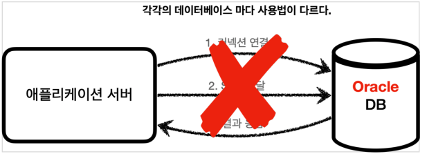
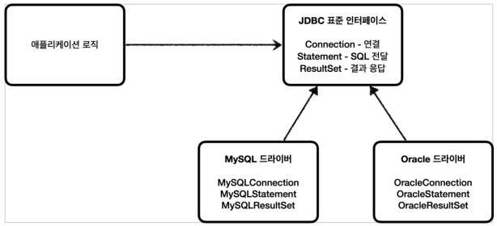

## JDBC 이해

### JDBC 등장 이유
#### 애플리케이션 서버와 DB - 일반적인 사용법
- 
- 커넥션 연결: 주로 TCP/IP를 사용해서 커넥션을 연결한다.
- SQL 전달: 애플리케이션 서버는 DB가 이해할 수 있는 SQL을 연결된 커넥션을 통해 DB에 전달한다.
- 결과 응답: DB는 전달된 SQL을 수행하고 그 결과를 응답한다. 애플리케이션 서버는 응답 결과를 활용한다

> 문제는 각각의 데이터베이스마다 커넥션을 연결하는 방법, SQL을 전달하는 방법, 그리고 결과를 응답 받는
> 방법이 모두 다르다는 점이다.

#### 여기에는 2가지 큰 문제가 있다
1. 데이터베이스를 다른 종류의 데이터베이스로 변경하면 애플리케이션 서버에 개발된 데이터베이스 사용
   코드도 함께 변경해야 한다.
2. 개발자가 각각의 데이터베이스마다 커넥션 연결, SQL 전달, 그리고 그 결과를 응답 받는 방법을 새로
   학습해야 한다.

> 이런 문제를 해결하기 위해 JDBC라는 자바 표준이 등장한다.

### JDBC 표준 인터페이스

> JDBC(Java Database Connectivity)는 자바에서 데이터베이스에 접속할 수 있도록 하는 자바 API 다.
> JDBC 는 데이터베이스에서 자료를 쿼리하거나 업데이트하는 방법을 제공한다. - 위키백과

#### JDBC 표준 인터페이스

대표적으로 다음 3가지 기능을 표준 인터페이스로 정의해서 제공한다.

- `java.sql.Connection` - 연결
- `java.sql.Statement` - SQL을 담은 내용
- `java.sql.ResultSet` - SQL 요청 응답

### **정리**
JDBC 의 등장으로 다음 2가지 문제가 해결되었다.
1. 데이터베이스를 다른 종류의 데이터베이스로 변경하면 애플리케이션 서버의 데이터베이스 사용 코드도 함께 변경해야하는 문제
   - 애플리케이션 로직은 이제 JDBC 표준 인터페이스에만 의존한다. 따라서 데이터베이스를 다른 종류의
   데이터베이스로 변경하고 싶으면 JDBC 구현 라이브러리만 변경하면 된다. 따라서 다른 종류의
   데이터베이스로 변경해도 애플리케이션 서버의 사용 코드를 그대로 유지할 수 있다.
2. 개발자가 각각의 데이터베이스마다 커넥션 연결, SQL 전달, 그리고 그 결과를 응답 받는 방법을 새로 학습해야하는 문제
   - 개발자는 JDBC 표준 인터페이스 사용법만 학습하면 된다. 한번 배워두면 수십개의 데이터베이스에 모두 동일하게 적용할 수 있다.