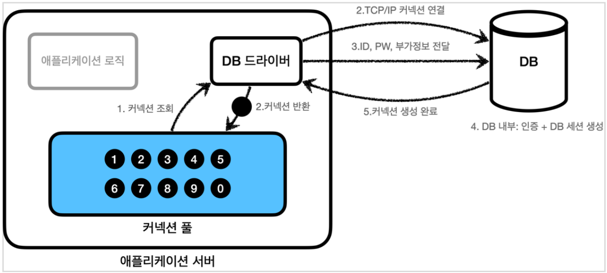
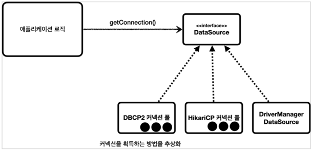

## 커넥션풀과 데이터소스 이해

> 커넥션 풀은 이름 그대로 커넥션을 관리하는 풀(수영장 풀을 상상하면 된다.)이다.

**풀 초기화**
- 
- 애플리케이션을 시작하는 시점에 커넥션 풀은 필요한 만큼 커넥션을 미리 확보해서 풀에 보관한다. 보통
얼마나 보관할 지는 서비스의 특징과 서버 스펙에 따라 다르지만 기본값은 보통 10개이다.

**정리**
- 적절한 커넥션 풀 숫자는 서비스의 특징과 애플리케이션 서버 스펙, DB 서버 스펙에 따라 다르기 때문에
성능 테스트를 통해서 정해야 한다.
- 커넥션 풀은 서버당 최대 커넥션 수를 제한할 수 있다. 따라서 DB에 무한정 연결이 생성되는 것을
막아주어서 DB를 보호하는 효과도 있다.
- 이런 커넥션 풀은 얻는 이점이 매우 크기 때문에 실무에서는 항상 기본으로 사용한다.
- 커넥션 풀은 개념적으로 단순해서 직접 구현할 수도 있지만, 사용도 편리하고 성능도 뛰어난 오픈소스
커넥션 풀이 많기 때문에 오픈소스를 사용하는 것이 좋다.
- 대표적인 커넥션 풀 오픈소스는 `commons-dbcp2`, `tomcat-jdbc pool`, `HikariCP` 등이 있다.
성능과 사용의 편리함 측면에서 최근에는 `hikariCP` 를 주로 사용한다. 스프링 부트 2.0 부터는 기본
커넥션 풀로 `hikariCP` 를 제공한다. 성능, 사용의 편리함, 안전성 측면에서 이미 검증이 되었기 때문에
커넥션 풀을 사용할 때는 고민할 것 없이 `hikariCP` 를 사용하면 된다. 실무에서도 레거시 프로젝트가 아닌
이상 대부분 `hikariCP` 를 사용한다.

DataSource 이해

  

- `DataSource` 는 커넥션을 획득하는 방법을 추상화 하는 인터페이스이다.
- 이 인터페이스의 핵심 기능은 커넥션 조회 하나이다. (다른 일부 기능도 있지만 크게 중요하지 않다.)