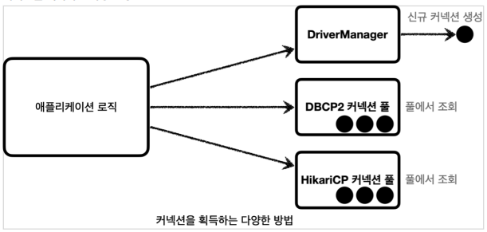
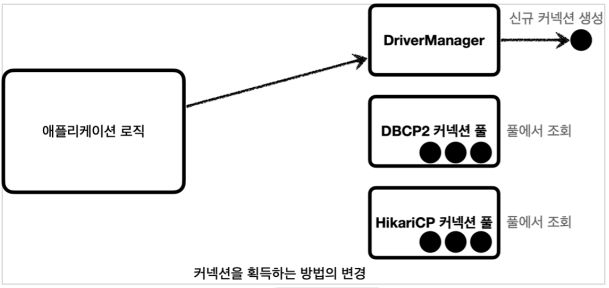
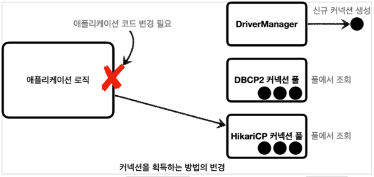
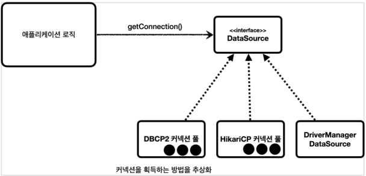

## DataSource 이해

커넥션을 얻는 방법은 앞서 학습한 JDBC DriverManager 를 직접 사용하거나, 커넥션 풀을 사용하는 등
다양한 방법이 존재한다.

#### 커넥션을 획득하는 다양한 방법



#### DriverManager를 통해 커넥션 획득



- 우리가 앞서 JDBC로 개발한 애플리케이션 처럼 DriverManager 를 통해서 커넥션을 획득하다가, 커넥션
  풀을 사용하는 방법으로 변경하려면 어떻게 해야할까?

#### DriverManager를 통해 커넥션 획득하다가 커넥션 풀로 변경시 문제



- 예를 들어서 애플리케이션 로직에서 `DriverManager` 를 사용해서 커넥션을 획득하다가 `HikariCP` 같은
  커넥션 풀을 사용하도록 변경하면 커넥션을 획득하는 애플리케이션 코드도 함께 변경해야 한다. 의존관계가
  `DriverManager` 에서 `HikariCP` 로 변경되기 때문이다. 물론 둘의 사용법도 조금씩 다를 것이다.

#### 커넥션을 획득하는 방법을 추상화



- 자바에서는 이런 문제를 해결하기 위해 `javax.sql.DataSource` 라는 인터페이스를 제공한다.
- `DataSource` 는 커넥션을 획득하는 방법을 추상화 하는 인터페이스이다.
- 이 인터페이스의 핵심 기능은 커넥션 조회 하나이다. (다른 일부 기능도 있지만 크게 중요하지 않다.)

#### DataSource 핵심 기능만 축약

```java
public interface DataSource {

    Connection getConnection() throws SQLException;
}
```

### 정리

- 대부분의 커넥션 풀은 `DataSource` 인터페이스를 이미 구현해두었다. 따라서 개발자는 `DBCP2` 커넥션 풀 ,
  `HikariCP` 커넥션 풀 의 코드를 직접 의존하는 것이 아니라 `DataSource` 인터페이스에만 의존하도록
  애플리케이션 로직을 작성하면 된다.
- 커넥션 풀 구현 기술을 변경하고 싶으면 해당 구현체로 갈아끼우기만 하면 된다.
- `DriverManager` 는 `DataSource` 인터페이스를 사용하지 않는다. 따라서 `DriverManager` 는 직접
  사용해야 한다. 따라서 `DriverManager` 를 사용하다가 `DataSource` 기반의 커넥션 풀을 사용하도록
  변경하면 관련 코드를 다 고쳐야 한다. 이런 문제를 해결하기 위해 스프링은 `DriverManager` 도
  `DataSource` 를 통해서 사용할 수 있도록 `DriverManagerDataSource` 라는 `DataSource` 를 구현한
  클래스를 제공한다.
- 자바는 `DataSource` 를 통해 커넥션을 획득하는 방법을 추상화했다. 이제 애플리케이션 로직은
  `DataSource` 인터페이스에만 의존하면 된다. 덕분에 `DriverManagerDataSource` 를 통해서
  `DriverManager` 를 사용하다가 커넥션 풀을 사용하도록 코드를 변경해도 애플리케이션 로직은 변경하지
  않아도 된다. 