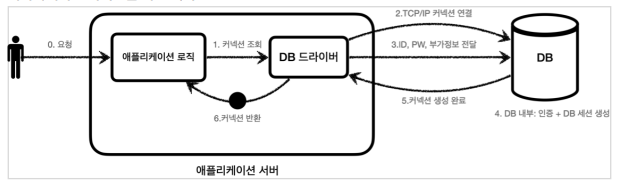
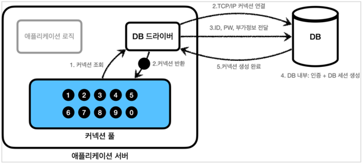
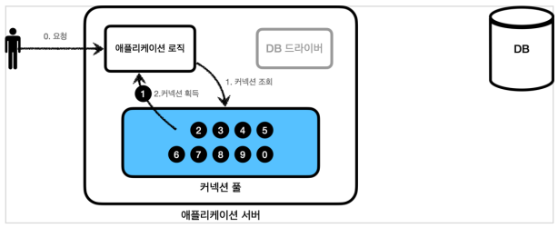
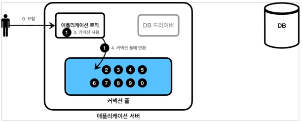

## 커넥션풀과 데이터소스 이해

### 데이터베이스 커넥션을 매번 획득

데이터베이스 커넥션을 획득할 때는 다음과 같은 복잡한 과정을 거친다.

1. 애플리케이션 로직은 DB 드라이버를 통해 커넥션을 조회한다.
2. DB 드라이버는 DB와 `TCP/IP` 커넥션을 연결한다. 물론 이 과정에서 `3 way handshake` 같은 `TCP/IP`
   연결을 위한 네트워크 동작이 발생한다.
3. DB 드라이버는 `TCP/IP` 커넥션이 연결되면 ID, PW와 기타 부가정보를 DB에 전달한다.
4. DB는 ID, PW를 통해 내부 인증을 완료하고, 내부에 DB 세션을 생성한다.
5. DB는 커넥션 생성이 완료되었다는 응답을 보낸다.
6. DB 드라이버는 커넥션 객체를 생성해서 클라이언트에 반환한다.

이렇게 커넥션을 새로 만드는 것은 과정도 복잡하고 시간도 많이 많이 소모되는 일이다.
DB는 물론이고 애플리케이션 서버에서도 `TCP/IP` 커넥션을 새로 생성하기 위한 리소스를 매번 사용해야
한다.
진짜 문제는 고객이 애플리케이션을 사용할 때, SQL 을 실행하는 시간 뿐만 아니라 커넥션을 새로 만드는
시간이 추가되기 때문에 결과적으로 응답 속도에 영향을 준다. 이것은 사용자에게 좋지 않은 경험을 줄 수
있다.

> **참고**: 데이터베이스마다 커넥션을 생성하는 시간은 다르다. 시스템 상황마다 다르지만 MySQL 계열은 수
> ms(밀리초) 정도로 매우 빨리 커넥션을 확보할 수 있다. 반면에 수십 밀리초 이상 걸리는 데이터베이스들도
> 있다.

이런 문제를 한번에 해결하는 아이디어가 바로 커넥션을 미리 생성해두고 사용하는 커넥션 풀이라는
방법이다.
커넥션 풀은 이름 그대로 커넥션을 관리하는 풀(수영장 풀을 상상하면 된다.)이다

---

### 풀 초기화

> 커넥션 풀은 이름 그대로 커넥션을 관리하는 풀(수영장 풀을 상상하면 된다.)이다.

애플리케이션을 시작하는 시점에 커넥션 풀은 필요한 만큼 커넥션을 미리 확보해서 풀에 보관한다. 보통
얼마나 보관할 지는 서비스의 특징과 서버 스펙에 따라 다르지만 기본값은 보통 10개이다.

### 커넥션 풀 사용1

- 애플리케이션 로직에서 이제는 DB 드라이버를 통해서 새로운 커넥션을 획득하는 것이 아니다.
- 이제는 커넥션 풀을 통해 이미 생성되어 있는 커넥션을 객체 참조로 그냥 가져다 쓰기만 하면 된다.
- 커넥션 풀에 커넥션을 요청하면 커넥션 풀은 자신이 가지고 있는 커넥션 중에 하나를 반환한다.

### 커넥션 풀 사용2

- 애플리케이션 로직은 커넥션 풀에서 받은 커넥션을 사용해서 SQL을 데이터베이스에 전달하고 그 결과를
  받아서 처리한다.
- 커넥션을 모두 사용하고 나면 이제는 커넥션을 종료하는 것이 아니라, 다음에 다시 사용할 수 있도록 해당
- 커넥션을 그대로 커넥션 풀에 반환하면 된다. 여기서 주의할 점은 커넥션을 종료하는 것이 아니라 커넥션이
- 살아있는 상태로 커넥션 풀에 반환해야 한다는 것이다.

### **정리**

- 적절한 커넥션 풀 숫자는 서비스의 특징과 애플리케이션 서버 스펙, DB 서버 스펙에 따라 다르기 때문에
  성능 테스트를 통해서 정해야 한다.
- 커넥션 풀은 서버당 최대 커넥션 수를 제한할 수 있다. 따라서 DB에 무한정 연결이 생성되는 것을
  막아주어서 DB를 보호하는 효과도 있다.
- 이런 커넥션 풀은 얻는 이점이 매우 크기 때문에 실무에서는 항상 기본으로 사용한다.
- 커넥션 풀은 개념적으로 단순해서 직접 구현할 수도 있지만, 사용도 편리하고 성능도 뛰어난 오픈소스
  커넥션 풀이 많기 때문에 오픈소스를 사용하는 것이 좋다.
- 대표적인 커넥션 풀 오픈소스는 `commons-dbcp2`, `tomcat-jdbc pool`, `HikariCP` 등이 있다.
  성능과 사용의 편리함 측면에서 최근에는 `hikariCP` 를 주로 사용한다. 스프링 부트 2.0 부터는 기본
  커넥션 풀로 `hikariCP` 를 제공한다. 성능, 사용의 편리함, 안전성 측면에서 이미 검증이 되었기 때문에
  커넥션 풀을 사용할 때는 고민할 것 없이 `hikariCP` 를 사용하면 된다. 실무에서도 레거시 프로젝트가 아닌
  이상 대부분 `hikariCP` 를 사용한다.