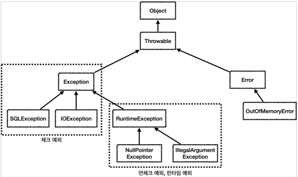

## 5. 자바 예외 이해

### 예외 계층

- 
- `Object` : 예외도 객체이다. 모든 객체의 최상위 부모는 `Object` 이므로 예외의 최상위 부모도 `Object`
  이다.
- `Throwable` : 최상위 예외이다. 하위에 `Exception` 과 `Error` 가 있다.
- `Error` : 메모리 부족이나 심각한 시스템 오류와 같이 애플리케이션에서 복구 불가능한 시스템 예외이다.
  애플리케이션 개발자는 이 예외를 잡으려고 해서는 안된다.
    - 상위 예외를 `catch` 로 잡으면 그 하위 예외까지 함께 잡는다. 따라서 애플리케이션 로직에서는
      `Throwable` 예외도 잡으면 안되는데, 앞서 이야기한 `Error` 예외도 함께 잡을 수 있기 때문에다.
      애플리케이션 로직은 이런 이유로 `Exception` 부터 필요한 예외로 생각하고 잡으면 된다.
    - 참고로 `Error` 도 **언체크** 예외이다.
- `Exception` : **체크 예외**
    - 애플리케이션 로직에서 사용할 수 있는 실질적인 최상위 예외이다.
    - `Exception` 과 그 하위 예외는 모두 컴파일러가 체크하는 **체크 예외**이다. 단 `RuntimeException` 은
      예외로 한다.
- `RuntimeException` : **언체크** 예외, **런타임** 예외
    - 컴파일러가 체크 하지 않는 **언체크** 예외이다.
    - `RuntimeException` 과 그 자식 예외는 모두 **언체크** 예외이다.
    - `RuntimeException` 의 이름을 따라서 `RuntimeException` 과 그 하위 언체크 예외를 런타임
      예외라고 많이 부른다. 여기서도 앞으로는 런타임 예외로 종종 부르겠다.

### 예외 기본 규칙

예외는 폭탄 돌리기와 같다. 잡아서 처리하거나, 처리할 수 없으면 밖으로 던져야한다.

#### 예외에 대해서는 2가지 기본 규칙을 기억하자.

1. 예외는 잡아서 처리하거나 던져야 한다.
2. 예외를 잡거나 던질 때 지정한 예외뿐만 아니라 그 예외의 자식들도 함께 처리된다.
    - 예를 들어서 Exception 을 catch 로 잡으면 그 하위 예외들도 모두 잡을 수 있다.
    - 예를 들어서 Exception 을 throws 로 던지면 그 하위 예외들도 모두 던질 수 있다.

### 체크 예외 기본 이해

- `Exception` 과 그 하위 예외는 모두 컴파일러가 체크하는 체크 예외이다. 단 `RuntimeException` 은
  예외로 한다.
- 체크 예외는 잡아서 처리하거나, 또는 밖으로 던지도록 선언해야한다. 그렇지 않으면 컴파일 오류가
  발생한다.

#### 체크 예외의 장단점

체크 예외는 예외를 잡아서 처리할 수 없을 때, 예외를 밖으로 던지는 throws 예외 를 필수로 선언해야
한다. 그렇지 않으면 컴파일 오류가 발생한다. 이것 때문에 장점과 단점이 동시에 존재한다.

- 장점: 개발자가 실수로 예외를 누락하지 않도록 컴파일러를 통해 문제를 잡아주는 훌륭한 안전 장치이다.
- 단점: 하지만 실제로는 개발자가 모든 체크 예외를 반드시 잡거나 던지도록 처리해야 하기 때문에, 너무
  번거로운 일이 된다. 크게 신경쓰고 싶지 않은 예외까지 모두 챙겨야 한다. 추가로 의존관계에 따른 단점도
  있는데 이 부분은 뒤에서 설명하겠다

### 언체크 예외 기본 이해

- `RuntimeException` 과 그 하위 예외는 언체크 예외로 분류된다.
- 언체크 예외는 말 그대로 컴파일러가 예외를 체크하지 않는다는 뜻이다.
- 언체크 예외는 체크 예외와 기본적으로 동일하다. 차이가 있다면 예외를 던지는 `throws` 를 선언하지 않고,
  생략할 수 있다. 이 경우 자동으로 예외를 던진다.

#### 체크 예외 VS 언체크 예외

- 체크 예외: 예외를 잡아서 처리하지 않으면 항상 throws 에 던지는 예외를 선언해야 한다.
- 언체크 예외: 예외를 잡아서 처리하지 않아도 throws 를 생략할 수 있다.

#### 언체크 예외의 장단점

언체크 예외는 예외를 잡아서 처리할 수 없을 때, 예외를 밖으로 던지는 throws 예외 를 생략할 수 있다.
이것 때문에 장점과 단점이 동시에 존재한다.

- 장점: 신경쓰고 싶지 않은 언체크 예외를 무시할 수 있다. 체크 예외의 경우 처리할 수 없는 예외를 밖으로
  던지려면 항상 throws 예외 를 선언해야 하지만, 언체크 예외는 이 부분을 생략할 수 있다. 이후에
  설명하겠지만, 신경쓰고 싶지 않은 예외의 의존관계를 참조하지 않아도 되는 장점이 있다.
- 단점: 언체크 예외는 개발자가 실수로 예외를 누락할 수 있다. 반면에 체크 예외는 컴파일러를 통해 예외
  누락을 잡아준다

**정리**  
체크 예외와 언체크 예외의 차이는 사실 예외를 처리할 수 없을 때 예외를 밖으로 던지는 부분에 있다. 이
부분을 필수로 선언해야 하는가 생략할 수 있는가의 차이다.
